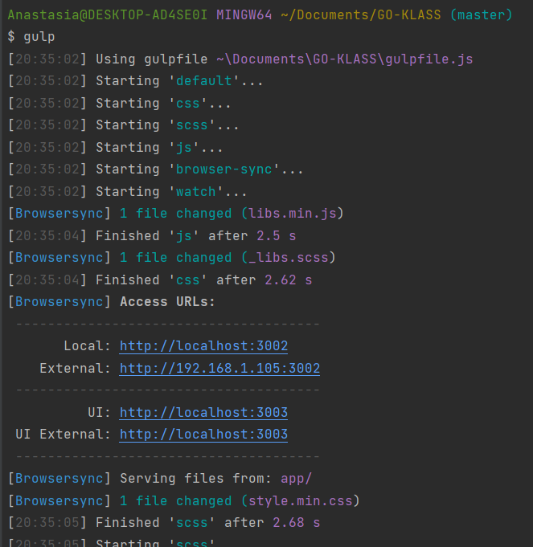

# GO-KLASS

1. npm install
2. gulp

Посилання Local відкриваєтся на комп'ютері

Посилання External можна відкривати на телефоні (треба бути підключеним до однієї мережі wi-fi)

Кожен раз обновляти сторінку не потрібно це робить сам gulp (повинен робити)
